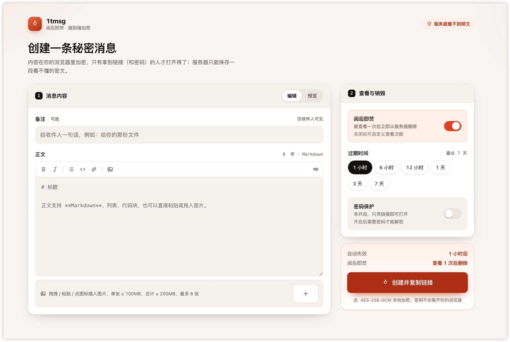
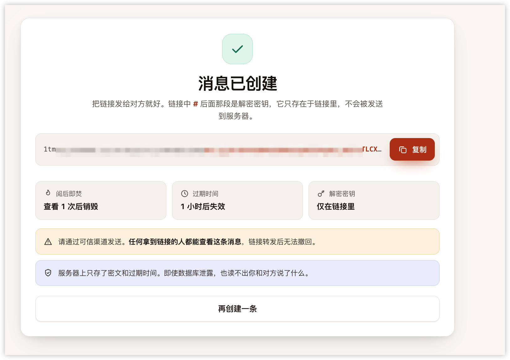
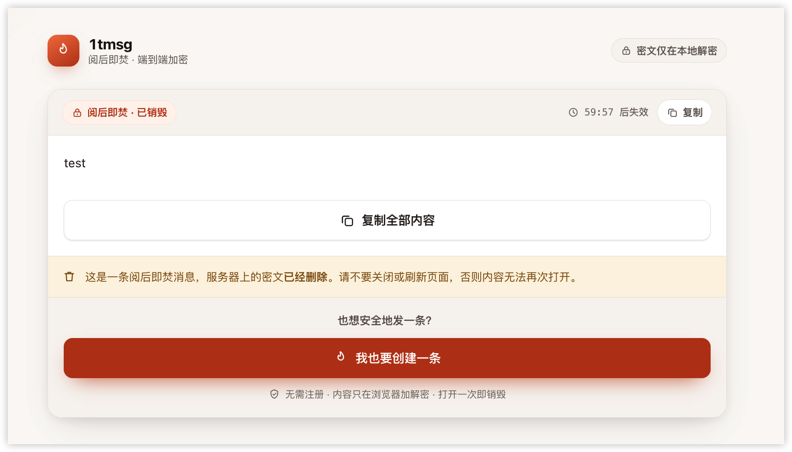
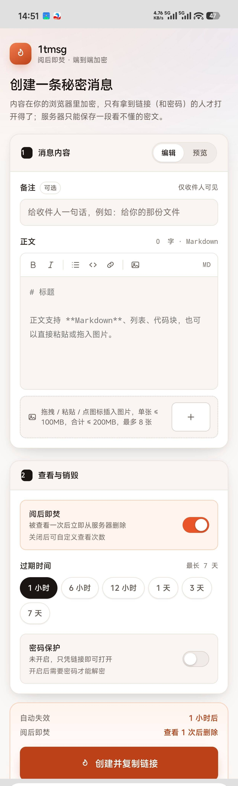

# 1tmsg · 阅后即焚的秘密消息

把密码、密钥、内部链接、一段文字发给别人 —— **对方看一次，服务器上的内容就立刻删除。**

内容在你的浏览器里加密，服务器上只存一段看不懂的密文：没有账号、没有服务器要维护、没有数据库要装、没有月费。

<p align="center">
  
</p>

> 💡 **5 分钟部署，免费额度内运行。** 你只需要一个 Cloudflare 账号，剩下的照抄命令即可。

<!--
📷 图片清单（文件放在 docs/static/，显示尺寸由本文件里的 width 控制；换图只需同名覆盖）
   create.png   创建页整页截图 2336×1568 —— 顶部横幅 宽560 / 预览区 宽600
   sent.png     创建成功页     1628×1150 —— 预览区 宽600
   view.png     查看页         1616×924  —— 预览区 宽600
   mobile.png   手机端长截图   1280×4223 —— 预览区 宽300
   注 1：顶部横幅暂复用 create.png（原计划的 hero.png 未产出，产出后可把顶部 src 换成 hero.png 并调小 width）
   注 2：截图取自支持图片的版本（wrangler.jsonc.example.r2）；默认部署的版本没有图片入口。
-->

---

## 30 秒了解它能做什么

| | |
|---|---|
| **适合** | 发一次性密码、API Key、内部地址、临时凭证、一段不想留在聊天记录里的文字；开启图片功能后还能发截图 |
| **不适合** | 长期存档、多人协作、需要审计留痕的场景 |
| **怎么保证隐私** | 链接里带着解密密钥（`#` 之后那段），浏览器负责加解密；服务器既没有密钥也没有明文 |
| **怎么销毁** | 默认「阅后即焚」：打开一次，服务器上的密文立即删除。也可以设置过期时间（最长 7 天）、可查看次数（1–100）、访问密码 |

简单说：**你在密码框里填的内容，Cloudflare 也看不到。**

---

<details>
<summary><b>界面预览</b> · 点击展开 4 张截图</summary>

<br>

**创建页** —— 写内容、选销毁方式、一键生成链接


**创建成功后** —— 链接里 `#` 后面那段就是解密密钥，服务器不会收到它



**对方打开时** —— 在浏览器本地解密，看完即销毁



**手机端** —— 窄屏同样可用



</details>

---

## 先选版本：要不要图片功能

**这是整个部署里唯一需要先做决策的地方：选哪份模板，就是选哪个版本。**

| | 仅文字（默认） | 支持图片 |
|---|---|---|
| 模板文件 | `wrangler.jsonc.example` | `wrangler.jsonc.example.r2` |
| 能发什么 | 文字、Markdown | 文字、Markdown、**图片**（单张 ≤ 100 MB） |
| 要开通 R2 | 不需要 | 需要 —— R2 开通时要求绑定支付方式 |

两份模板只差一段 `r2_buckets` 声明 —— **有这段就是支持图片的版本**。

图片密文存在 Cloudflare R2 对象存储里，而 R2 开通时必须绑支付方式。不想绑卡的人不少，所以**默认用的是仅文字的那份，整个流程一次都不会碰 R2**。

「配置里有没有 `r2_buckets`」同时决定三件事 —— 是否声明 R2 绑定、前端是否构建出图片入口、服务端是否接受图片附件的请求 —— 所以不会出现「界面上有按钮、后端却不认」的错配。

---

## 手动部署/一键部署：约 5 分钟

### 准备工作

| 需要 | 说明 |
|---|---|
| Cloudflare 账号(必须) | 免费注册：https://dash.cloudflare.com/sign-up |
| Git (手动部署)| 克隆仓库用；没装的话去 https://git-scm.com 下载 |
| Node.js 22+ (手动部署)| 终端执行 `node -v` 查看；没有的话去 https://nodejs.org 下载 LTS 版 |

### 第 1 步 · 选版本并部署（两个 tab 二选一）

下面两个 tab 各是一条**完整路径**，按需挑一个照着走完即可。**默认展开「仅文字」**；想发图片就切到「支持图片」tab，它会多出开通 R2、建桶两步。两个版本的差异见上方「先选版本」。

<details>
<summary>🟦 仅文字（默认）</summary>

#### 一键部署:
 [](https://deploy.workers.cloudflare.com/?url=https://github.com/CJSen/1tmsg)

#### 手动部署

**① 克隆仓库,复制配置模板**

```bash
git clone https://github.com/<你的账号>/1tmsg.git
cd 1tmsg
cp wrangler.jsonc.example wrangler.jsonc
```

**② 安装依赖**

```bash
npm install
```

**③ 登录 Cloudflare**

```bash
npx wrangler login
```

会自动打开浏览器，点一下 **允许** 就完成授权。

**④ 部署**

```bash
npm run deploy
```

</details>

<details>
<summary>🟨 支持图片（需 R2,需绑卡）</summary>

#### 一键部署
 [](https://deploy.workers.cloudflare.com/?url=https://github.com/CJSen/1tmsg/tree/deploy-images)

> ⚠️ 支持图片版：按钮会自动建 R2 桶，但**你的账号需先开通 R2（绑支付方式）**，否则开通桶那一步会失败。仅文字版零门槛。

#### 手动部署

**① 克隆仓库,复制配置模板**

```bash
git clone https://github.com/<你的账号>/1tmsg.git
cd 1tmsg
cp wrangler.jsonc.example wrangler.jsonc
```

**② 开通 R2 并建桶**

登录 Cloudflare 控制台，左侧点 **R2** → 按提示完成开通（免费额度 10 GB/月，但开通时需绑支付方式）。然后建桶并加一条 7 天自动清理兜底：

```bash
npx wrangler r2 bucket create 1tmsg-blobs
npx wrangler r2 bucket lifecycle add 1tmsg-blobs expire-old --expire-days 7
```

> ⚠️ 不要把桶设为公开可读（不要绑自定义域、不要开 r2.dev 公网域名），否则「阅后即焚」失效。

**③ 安装依赖**

```bash
npm install
```

**④ 登录 Cloudflare**

```bash
npx wrangler login
```

会自动打开浏览器，点一下 **允许** 就完成授权。

**⑤ 部署**

```bash
npm run deploy
```

</details>

### 完成后

终端会打印出你的访问地址，形如：

```
https://1tmsg.<你的账号>.workers.dev
```

打开它就用上了。**这个地址就是你的服务主页**，把它分享给需要使用的人即可。

---

## 部署后想调整

| 想做的事 | 怎么做 |
|---|---|
| **切换站点默认语言** | 编辑 `wrangler.jsonc` 的 `vars.DEFAULT_LOCALE`（`"zh"` / `"en"`，缺省 `zh`），重新 `npm run deploy`。界面中英双语；**不做浏览器语言自动跟随** —— 站点语言就是这个值，访客可用页面右上角的 `EN / 中文` 按钮手动切换（选择会被记住） |
| **开启 / 关闭图片功能** | 在 `wrangler.jsonc` 里加上 / 删掉 `r2_buckets` 那一段即可（加之前先开通 R2 并建桶），改完重新 `npm run deploy`；也可以直接换模板复制 |
| **用自己的域名** | 编辑 `wrangler.jsonc`，取消 `routes` 那行注释并替换成你的域名，重新 `npm run deploy`。域名需已托管在 Cloudflare；证书与 DNS 记录会自动创建，**不要**再手动加 A/CNAME |
| **改 Worker 名字** | 改 `wrangler.jsonc` 的 `name`。如果开着图片功能，建桶命令里的桶名也要保持一致（或另起一个桶名并同步改 `bucket_name`） |
| **关闭 workers.dev 备用地址** | 删掉 `wrangler.jsonc` 里的 `workers_dev` 行，只保留自定义域名 |
| **调整单条消息 / 图片上限** | 改 `wrangler.jsonc` 的 `vars`（`MAX_MESSAGE_BYTES`、`MAX_ATTACHMENT_BYTES`、`RATE_LIMIT_MAX_CREATES`）后重新部署。后两项只在支持图片的版本里有意义 |
| **更新版本** | `git pull && npm run deploy` 即可覆盖升级。开关、域名这些本地改动都留在 `wrangler.jsonc` 里，不受影响 |

`wrangler.jsonc` 已加入 `.gitignore`（它会带你的真实域名与桶名），改动只留在本地。

---

## 怎么用它

1. **打开你的服务地址**，填写内容（支持 Markdown；支持图片的版本还可以直接粘贴或拖入图片）。
2. 按需选择：**阅后即焚**（默认开）／过期时间／可查看次数／访问密码，然后点 **创建并复制链接**。
3. **把链接发给对方**。对方打开一次，内容就在浏览器里解密显示，然后服务器上的密文被删除。

> 链接转发后无法撤回 —— 任何拿到链接的人都能查看。请通过可信渠道发送。

---

## 默认限制

| 项 | 值 |
|---|---|
| 单张图片 ※ | ≤ 100 MB，最多 8 张 |
| 图片合计 ※ | ≤ 200 MB / 条 |
| 文本内容 | ≤ 10 MB |
| 过期时间 | 1 分钟 – 7 天，默认 1 小时 |
| 可查看次数 | 1 – 100，默认 5（关闭阅后即焚时可用） |
| 备注 | ≤ 120 字 |
| 访问密码 | ≥ 6 位，连续输错 10 次销毁消息 |
| 创建频率 | 每 IP 每分钟 30 条 |

> ※ 仅支持图片的版本（`wrangler.jsonc.example.r2`）有此限制；仅文字的版本用不到这几项。

---

## 关于安全

- **明文只在你的浏览器里存在。** 加密与解密都在本地完成，服务器只负责存取密文。
- **解密密钥放在链接的 `#` 之后。** 浏览器规范保证这部分永远不会发给服务器，页面打开后也会立刻从地址栏抹掉。
- **数据库泄露也读不出内容。** 攻击者拿到的只是 `密文 + 过期时间 + 查看次数` 这类元数据。
- **页面零外部依赖。** 不加载任何 CDN、统计脚本、外部字体与图片，所有前端代码都来自这个项目自己。
- **服务上没有任何内联脚本。** 配合严格的 CSP 与安全响应头，第三方很难往解密页面里塞东西。
- **唯一的本地存储是语言偏好。** 只有点了右上角的 `EN / 中文` 按钮才会在浏览器里记一个 `"zh"` 或 `"en"`，不含任何消息、密钥或内容；自动跟随浏览器语言不写存储。

完整的安全模型、密钥派生方式、图片为什么要单独走对象存储、以及全部已知取舍，见 **[docs/spec.md](docs/spec.md)**。

---

## 常见问题

**Q：需要花钱吗？**
免费计划够用：Workers 每天 10 万次请求、Durable Objects 存储 5 GB；若开启图片功能，再加上 R2 的 10 GB / 月（下载不计费）。用量都在免费额度内，**不会自动扣费**，超额时会直接报错而不是产生账单。仅文字的版本连 R2 都不用开通，也就没有绑卡这一步。

**Q：服务器能看到我写了什么吗？**
不能。服务器只保存密文和过期时间。但请记住：**持有完整链接的人可以解开它** —— 这是这个工具存在的意义，也意味着链接转发后无法撤回。

**Q：我把链接发错人了怎么办？**
没有人能远程撤回一条已发出的链接。可行的做法是：如果消息设置了密码，收件人没有密码就打不开；否则尽快等它过期（把过期时间设短一些是好习惯）。

**Q：`wrangler login` 卡住或失败？**
多为网络问题。可以尝试开启代理后重试，或改用 API Token 方式登录（Cloudflare 控制台 → My Profile → API Tokens）。

**Q：我不想绑卡，能用吗？**
能，而且这就是默认路径 —— 仅文字的版本全程不需要 R2，也就不需要绑支付方式。照 `npm install && npx wrangler login && npm run deploy` 三步走完即可。

**Q：部署时提示要开通 R2、要求绑卡？**
说明 `wrangler.jsonc` 里声明了 `r2_buckets`（也就是用了支持图片的那份模板）。不想绑卡就换成仅文字的版本：把那段 `r2_buckets` 删掉，或重新 `cp wrangler.jsonc.example wrangler.jsonc`，再 `npm run deploy`。

**Q：先部署了仅文字的版本，之后想加图片怎么办？**
按上文完成 R2 开通与建桶，把 `wrangler.jsonc.example.r2` 里那段 `r2_buckets` 抄进 `wrangler.jsonc`（或直接用这份模板覆盖），再 `npm run deploy`。反过来（从支持图片改回仅文字）之后，**之前发出的带图片消息里的图片会打不开** —— 正文和备注仍可正常查看，图片位置显示为缺失占位。

**Q：部署时报错说找不到 bucket？**
说明建桶时的名字和 `wrangler.jsonc` 里的 `bucket_name` 不一致。两边改成同一个名字即可（默认都是 `1tmsg-blobs`）。

**Q：部署成功了但打不开页面？**
先等 30 秒左右（新 Worker 首次上线需要一点时间）；仍打不开时确认 `wrangler.jsonc` 的 `workers_dev` 没有被删掉，并且用的是终端打印出的那个地址。

**Q：本地调试时创建到第 30 条就报 429？**
本地环境所有请求共用同一个 IP 标识，命中「每分钟 30 条」的创建限流。线上按真实 IP 分桶，不存在这个问题。

**Q：为什么图片要单独用 R2？只用数据库不行吗？**
图片是二进制大文件，塞进数据库会让取一段文字也变成下载全部图片。本项目把**文本密文存数据库、图片密文存对象存储**，两者都是一次性访问，安全性不受影响。不想用 R2 就部署仅文字的版本，损失只在图片。

---

## 本地开发（可选）

```bash
npm run dev          # 构建前端并启动本地服务（http://localhost:8787）
npm run typecheck    # TypeScript 类型检查
npm run build        # 只构建前端资源
```

`dev` / `build` / `deploy` 都会按当前 `wrangler.jsonc` 重建前端，所以本地看到的就是部署后的样子。想本地预览仅文字的版本，把配置换成仅文字的模板再启动即可：

```bash
cp wrangler.jsonc.example wrangler.jsonc && npm run dev
```

本地调试用的是 wrangler 的本地模拟存储，**带着 `r2_buckets` 也不需要真的开通 R2**，不涉及绑卡。

---

## 技术细节

如果你关心实现原理 —— 密钥怎么派生、为什么多存一个 `verifier`、图片如何避免泄露收件人 IP、`readToken` 宽限期怎么设计 —— 请看：

- **[docs/spec.md](docs/spec.md)** —— 完整设计规格

技术栈：TypeScript + Web Crypto，Cloudflare Workers + Durable Objects（SQLite）；开启图片功能时再加一个私有 R2 桶。不需要 VPS、MySQL、Redis。

---

## 许可

[MIT License](LICENSE) © 2026 chjs
